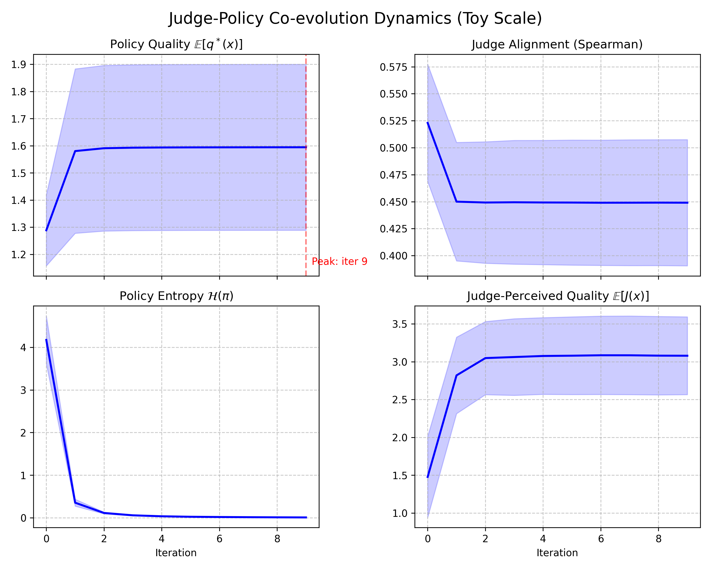
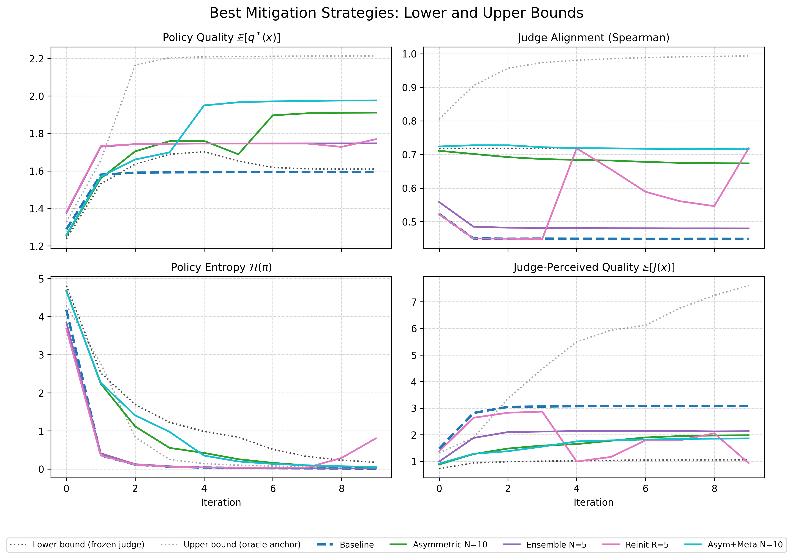

*A fully enumerable toy experiment on evaluator drift, policy collapse, and the ceiling on self-improvement.*

I built a fully enumerable toy lab for judge-policy self-play to test a narrow question: does co-evolution between a policy and its judge produce a stable improvement process, or does the evaluator drift faster than the policy genuinely improves? In the baseline, the loop fails quickly. Real quality plateaus after the first iteration, judge alignment decays, policy entropy collapses, and the system's internal score continues to rise. The interventions that help most are the ones that slow or externally correct the judge, rather than the ones that make the judging machinery more elaborate.

If that pattern survives in a setting small enough to measure exactly, it is worth taking seriously as a systems-design issue rather than treating it as scale-specific noise.

This experiment grew out of a question I raised in Part 4 / Frontier 5 of [From Human Feedback to Synthetic Alignment](https://jmamath.github.io/blog/synthetic-alignment-future/#5-judge-policy-co-evolution-dynamics), specifically in the section "Judge-Policy Co-Evolution Dynamics": once the judge and policy start adapting to each other, what keeps the loop from collapsing, drifting, or amplifying its own biases? This post is a small empirical attempt to make that question concrete.

**Bottom line**

- Baseline self-play is not stable in this toy setup.
- The core failure mode is a combination of evaluator drift and search collapse.
- Slower judge updates help materially.
- Meta-correction helps mainly when paired with slower updates.
- Oracle grounding clarifies the upper bound, but it is not a practical result.

## The question

If a policy improves against a judge that is itself being updated on the policy's distribution, is there a stable equilibrium, or does the loop optimize against its own evaluator faster than it makes real progress? Once both sides adapt, you no longer have a stationary objective — you have a coupled dynamical system. That matters in practice because internal reward can keep climbing while real quality stalls, and the design choices that look like implementation details (update cadence, judge diversity, resets, anchors, external validation) are really attempts to control that system. This project is not a benchmark or a proxy for LLM scale. It is the smallest diagnostic setup I could build where those possibilities can be separated exactly.

## The setup

The world is deliberately small:

- Outputs are length-4 token sequences over an 8-token vocabulary.
- That gives a total output space of 4,096 sequences.
- Ground-truth quality, `q*`, is fixed and hidden from the judge.
- The policy is a small GRU that defines a distribution over sequences.
- The judge is a small GRU scorer, pretrained to partial alignment with `q*`.

The point of the toy is full enumerability: exact expected policy quality under `q*`, exact policy entropy, and exact judge–ground-truth alignment, with no sampling noise. If training stalls, I want to know whether the policy stopped improving, the judge drifted, or the search distribution collapsed — and at this scale I can tell.

## Baseline: the loop fails fast

Four metrics per outer iteration separate external reality from the system's internal self-evaluation: `policy_quality` (expected ground-truth quality under the current policy), `judge_alignment` (Spearman correlation between judge scores and `q*`), `policy_entropy` (how broad or collapsed the policy distribution is), and `judge_perceived_quality` (the expected score the judge assigns to policy outputs).

*Baseline self-play across 5 seeds. Real quality (top-left) rises once, then largely stops. Judge alignment with ground truth (top-right) falls, policy entropy (bottom-left) collapses, and judge-perceived quality (bottom-right) keeps rising.*

The baseline result is not a gradual degradation story. It is a fast-collapse story. Self-rewarding training finds an early gain, then mostly stops making real progress while the evaluator keeps becoming easier to satisfy.

The top-left and bottom-right panels are the key read. Real policy quality improves sharply at the beginning, then almost completely plateaus. In most seeds, the policy reaches roughly the same local optimum by iteration 1 and barely moves afterward. One seed lands in a much worse local mode and plateaus there. Meanwhile judge-perceived quality keeps climbing through the full run. The gap between what the policy is actually achieving and what the system thinks it is achieving widens every iteration.

The top-right panel shows the evaluator side of the story. The judge starts partially aligned with `q*`, then loses alignment quickly once co-evolution begins. The initial drop is the sharpest part, and the judge remains materially less aligned than where it started. The policy is not just optimizing against a fixed imperfect evaluator. It is optimizing against an evaluator that is moving with it.

The bottom-left panel shows the search dynamics. Policy entropy starts relatively high, then collapses almost immediately. By iteration 3, the policy is near-deterministic. That matters because it compresses the rest of the training run. Once the search distribution has collapsed this hard, later iterations have very little room to discover better modes.

Put together, the baseline looks like this:

1. The policy finds an early improvement.
2. The search distribution collapses.
3. The judge drifts on the policy's shrinking support.
4. Internal reward keeps increasing even though real quality has mostly stopped improving.

From inside the loop, training looks successful. From outside the loop, it has largely stopped improving and is increasingly optimizing against a drifting evaluator.

Two details are worth being explicit about.

First, the timescale is compressed. The literature often describes a 3-to-4 iteration ceiling. Here, the ceiling appears at iteration 1. I do not read that as a contradiction. A more plausible interpretation is that the same qualitative dynamic is playing out in a world small enough for entropy collapse to complete almost immediately.

Second, the bad baseline seed matters, but not because it should be hidden. It reveals initialization sensitivity. Later, when some interventions improve the mean without raising the per-seed ceiling, that distinction matters.

For a team building judge-mediated training loops, the practical implication is straightforward: internal score growth is not a safe proxy for progress. If a loop can keep reporting higher reward after real gains have mostly stopped, evaluator drift and search collapse need to be instrumented directly.

## What changes the outcome

It is more useful to think about the interventions by mechanism than by run name. If the problem is tight judge-policy coupling, the natural question is: what weakens or stabilizes that coupling?

The comparison is easiest to read if it is framed between two boundary conditions:

- a frozen judge, which never co-evolves after pretraining
- an oracle grounding condition, which continuously corrects the judge toward `q*`

*Boundary conditions plus the strongest practical mitigations. The useful comparison is not "which line is highest?" but "which mechanisms preserve alignment and keep search alive long enough for real quality to improve?"*

The frozen judge is a useful lower bound. It keeps alignment high by construction and preserves more entropy than the baseline, but mean quality ends up almost identical to baseline. A static evaluator does not solve the problem on its own. It avoids one kind of drift, but it also stops adapting in ways the policy may need.

The oracle condition is the opposite bound. It keeps the judge grounded with direct access to `q*` during training and reaches the highest quality by far. I do not count that as a practical result. It is an upper bound. Its value is diagnostic: it shows that the baseline ceiling is not an intrinsic limit of the world itself. If the judge can stay grounded, the policy can continue improving well past the baseline plateau.

That framing makes the main result clearer. The problem is not that judge updates are inherently bad. The problem is that ungrounded, tightly coupled judge updates drift quickly enough to collapse the search.

### Slower judge updates are the clearest practical win

Method in one sentence: keep updating the policy on every step, but update the judge only periodically on the policy's data rather than after every policy update.

I tried judge refresh cadences of once every 2, 5, and 10 policy updates, and I report the strongest case here: updating the judge once for every 10 policy updates. This was the clearest practical win in the experiment.

At the end of the run:

- Baseline mean quality is about `1.59`.
- The best slower-update setting reaches about `1.91`.
- Mean judge alignment is much higher than baseline.
- Entropy remains measurably above zero much longer.

The mechanism is consistent across the panels. Slowing the judge buys the policy more time to explore under a less-drifted evaluator. The judge is still imperfect, but it does not chase the policy distribution quickly enough to collapse the loop as aggressively.

If I had to reduce the practical lesson of the toy to one sentence, it would be this: the loop gets healthier when the judge changes more slowly than the policy.

### Meta-correction helps when it is paired with slower judge updates

Method in one sentence: in addition to slowing judge updates, periodically correct the judge using a small held-out set of uniformly sampled outputs with ground-truth labels. This is a toy version of the meta-rewarding setup from Wu et al. 2024.

I tried combined judge/meta update cadences of every 1, 10, and 200 policy updates, together with held-out fractions of 5% and 10%, and I report the strongest case here: updating the judge and correction step every 10 policy updates with a 5% held-out set.

That setting reaches mean quality around `1.98`, with strong alignment retention and slower entropy collapse than baseline. It is one of the best non-oracle outcomes in the experiment.

The cleanest interpretation is timing. A corrective signal only matters if the rest of the loop still preserves enough search and enough evaluator stability for that correction to land. Once the judge is changing more slowly, even a small external correction becomes useful.

That is a more specific lesson than "meta-correction helps." A better reading is: small corrective signals can help, but only when the loop has already been slowed down enough to make them matter.

### What mostly did not raise the ceiling

Two other interventions are worth covering briefly because they look better at first glance than they really are.

#### Ensembles
Method in one sentence for ensembles: replace a single judge with several independently initialized judges and reward the policy using their average score.

I tried small ensembles of 3 and 5 judges and report the best case here. It removes the bad baseline outlier and brings mean quality up to about `1.75`, but it does not raise the underlying ceiling. The attractor stays the same. In other words, averaging judges makes training less brittle, but it does not create sustained additional improvement.

#### Periodic reinitialization
Method in one sentence for periodic reinitialization: reset the judge back toward its pretrained state at fixed intervals so the policy is periodically evaluated by a less-drifted model.

I tried reset intervals of every 3 and 5 outer iterations and report the best case here. It improves mean quality modestly to about `1.77` and preserves high alignment, but it does so by repeatedly disturbing the loop. Some runs re-explore usefully, others destabilize. The most honest summary is that reinitialization can sometimes break the system out of a local mode, but it is not a clean or reliable mechanism.

Those results matter because they keep the argument disciplined. Not every intervention that sounds sensible is actually changing the main bottleneck.

## Compact summary of end-state outcomes

The clearest way to summarize the experiment is to separate practical methods from boundary conditions.

| Condition | Mean quality | Mean alignment | Read |
|---|---:|---:|---|
| Baseline | 1.594 | 0.449 | Fast collapse, evaluator drift, little sustained improvement |
| Frozen judge | 1.610 | 0.718 | Stable evaluator, but weak and inconsistent quality gains |
| Slower judge updates | 1.912 | 0.674 | Strongest practical single-mechanism win |
| Slower judge updates + meta-correction | 1.977 | 0.715 | Best practical combined condition |
| Judge ensemble | 1.747 | 0.480 | Variance reduction, not ceiling lift |
| Periodic reinitialization | 1.770 | 0.718 | Some re-exploration, but noisy |
| Anchor 10% | 2.214 | 0.993 | Oracle upper bound, not a practical result |

The important distinction in that table is not just which number is largest. It is which mechanisms actually keep the policy improving, and which ones mainly make the baseline attractor less noisy.

## What I take from this

The main update is not that judge-mediated training is impossible. It is that the stability problem looks architectural. The failure did not come from a lack of judge sophistication — the judge was already good enough to produce an early improvement. It came from the interaction between evaluator drift and search collapse: once the policy distribution narrowed too quickly, the judge began adapting on a shrinking support, and internal reward decoupled from real progress. The strongest non-oracle improvements came from reducing coupling speed and preserving calibration long enough for search to continue. That is more specific and more useful than a general warning about reward hacking.

Four practical lessons for real system design:

- Instrument evaluator drift separately from reward growth.
- Treat entropy collapse as a monitored failure mode, not just convergence.
- Test slower evaluator update schedules before adding more judge complexity.
- Be skeptical of gains that disappear once variance reduction is separated from ceiling improvement.

**Limitations.** Toy scale; synthetic ground-truth quality function; no language, no prompts, no real LMs; a single output-space size and one architecture family. These results show that the core dynamics arise in a world small enough to inspect exactly. They do not tell us how the same mechanisms behave with richer output spaces, more expressive models, or grounding signals less direct than `q*`.

## Closing

I built this lab to see whether the worry behind judge-policy self-play was substantive enough to survive miniature scale. It was. The models were tiny, the world was enumerable, and the failure mode still appeared almost immediately. That does not settle the broader question, but it does make it feel less speculative and more like an engineering problem: if judge-mediated systems are going to work reliably, they will need to be instrumented and paced so that evaluator drift does not outrun genuine improvement.

Code, configs, seeds, and the figures above: [github.com/jmamath/co-evolution-lab](https://github.com/jmamath/co-evolution-lab).
