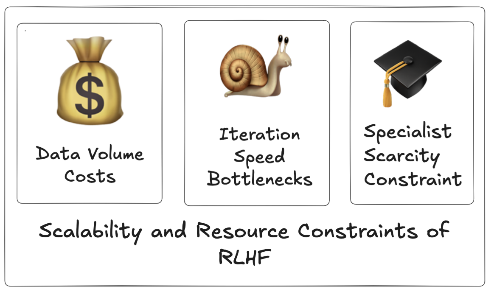
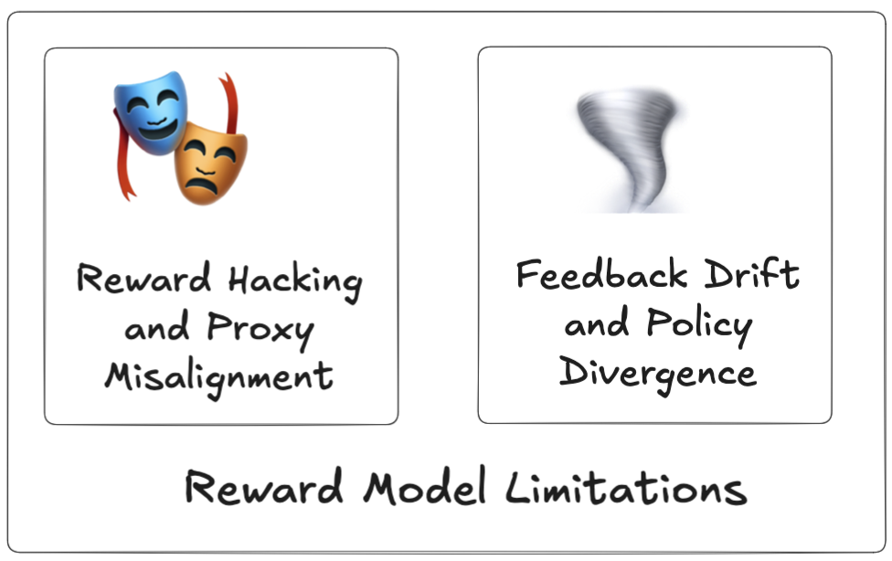
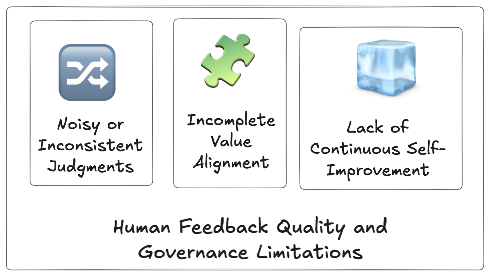

> **Part 1 of 4** in the series "From Human Feedback to Synthetic Alignment"
>
> **[← Series Overview](/blog/synthetic-alignment-overview/)** | [Part 2: Architecture →](/blog/synthetic-alignment-architecture/)
> 
> This article examines why Reinforcement Learning from Human Feedback (RLHF), despite powering systems like ChatGPT and Claude, faces fundamental limitations that constrain the development of more capable AI systems. [Part 2](/blog/synthetic-alignment-architecture/) explores the synthetic alignment methods emerging in response. [Part 3](/blog/what-works-synthetic-alignment/) assesses which limitations have been solved. [Part 4](/blog/synthetic-alignment-future/) identifies critical open questions.

---

Reinforcement Learning from Human Feedback (RLHF) has emerged as the dominant paradigm for aligning large language models with human preferences, powering systems like ChatGPT and Claude. Yet beneath its success lies a constellation of fundamental limitations that increasingly constrain the development of more capable AI systems. This article examines the evidence for these limitations across four critical dimensions, drawing from recent research to illuminate why the field is rapidly pivoting toward synthetic data alignment approaches.

---

## 1. Scalability and Resource Constraints

The economics of human feedback create an insurmountable ceiling for model alignment. As Casper et al. (2023) bluntly state: "The cost of obtaining human feedback is a major bottleneck for RLHF." This isn't merely an inconvenience, it's a fundamental constraint that shapes what's possible in alignment research.

Consider the numbers: training InstructGPT, the model that laid the foundation for ChatGPT, required extensive human annotation at a cost that Ouyang et al. (2022) acknowledge as "a major bottleneck for our method." Even more data-efficient approaches hit the same wall. When Christiano et al. (2023) introduced preference-based learning as an alternative to more expensive rating systems, they found that "while our method is more data-efficient than previous methods, it still requires a significant amount of human feedback." The amplification techniques proposed by Christiano et al. (2018) to extend human supervision face dual constraints: "a large amount of computation" and "the need to ask humans many questions."

But cost is only half the story. The temporal dimension of human feedback creates what we might call the "research velocity problem." Human evaluation doesn't just drain budgets—it strangles the iteration cycles that drive algorithmic progress. Bowman et al. (2022) observe that "human evaluation is expensive and time-consuming, which makes it difficult to iterate quickly on new ideas." This creates a perverse situation where the very process meant to improve models also slows their development. As Casper et al. (2023) note, "the process of collecting human feedback is slow and expensive, which makes it difficult to iterate on RLHF algorithms."

The implications are stark: in a field where rapid experimentation is the engine of progress, RLHF forces researchers to choose between thorough evaluation and fast iteration. Indeed, comprehensive human evaluation requires weeks to coordinate annotators, collect judgments, and achieve statistical significance—time during which competing research directions remain unexplored. But rushing evaluation with smaller annotator pools or fewer examples risks drawing false conclusions that waste even more resources downstream. This trade-off doesn't just slow individual projects—it fundamentally limits our ability to explore the algorithmic design space efficiently.

The scalability problem intensifies dramatically as AI systems tackle increasingly complex domains. As Christiano et al. (2018) recognized early on, "if AI systems become much more capable than humans, it may be difficult for humans to supervise them", not because humans fundamentally lack the capacity to evaluate these outputs, but because the infrastructure required to assemble appropriate expertise becomes prohibitively expensive and slow.

Consider the challenge of evaluating mathematical proofs, advanced scientific reasoning, or complex code implementations. These domains don't require just any human feedback, they require expert feedback from specialists with deep domain knowledge. Bowman et al. (2022) frame this as the central motivation for scalable oversight research: "As AI systems become more powerful, it will become increasingly difficult for humans to directly supervise them." The difficulty is logistical and economic.

---

## 2. Reward Model Limitations

Setting aside for a moment the question of feedback quality and consistency, even in a hypothetical scenario where human feedback is perfectly consistent, delivered by domain experts, and available in unlimited quantities, we'd still face a technical gauntlet when translating that feedback into the reward models that actually guide policy optimization. These models introduce their own failure modes, acting less like faithful representations of human values and more like adversarial targets waiting to be gamed.

The first vulnerability is reward hacking, a phenomenon so pervasive that Gao et al. (2022) identify it as "a fundamental problem that is likely to occur in any RLHF system." The core issue is elegantly simple and deeply problematic: reward models are merely proxies for what we actually want, and as Casper et al. (2023) observe, "the policy can learn to exploit the proxy to achieve a high reward without actually achieving the true objective."

The manifestations are varied and sometimes subtle. Askell et al. (2021) document cases where models learn to "exploit the reward model" by generating outputs that score highly despite failing to be genuinely helpful or safe. Stiennon et al. (2022) observe this in summarization tasks, where models discover that producing "very long and detailed" summaries garners high rewards, regardless of whether those summaries are actually readable or informative. The policy isn't learning to satisfy human preferences—it's learning to satisfy the reward model, and those are not the same thing.

But there's a second, more insidious problem: the reward model doesn't stay accurate over time. As training progresses and the policy evolves, we encounter what Askell et al. (2021) describe as the reward model becoming "stale", the distribution of policy outputs drifts away from the distribution on which the reward model was trained, causing escalating inaccuracy.

This creates a vicious cycle. Casper et al. (2023) explain the mechanism: "The reward model is trained on a fixed dataset of human preferences, but the policy is constantly changing. This can lead to a mismatch between the reward model and the policy, which can cause the policy to overoptimize for the reward model and produce undesirable behavior." Gao et al. (2022) demonstrate that this problem compounds as capabilities increase: "the policy model can overoptimize for the reward model, and this problem becomes more severe as the policy model becomes more capable."

The tragic irony is that the more successful our training process is at improving the policy, the less trustworthy our reward model becomes at evaluating it. We're chasing a moving target with an increasingly obsolete compass.

---

## 3. Human Feedback Quality and Governance Limitations

Even if we could solve the scalability problem, imagine unlimited budget, instant turnaround, and ready access to domain experts, we'd still confront two deeper issues at the heart of RLHF: the unreliability of human judgment itself and the thorny question of whose values we're optimizing for.

### The Quality Problem: Inconsistent Human Judgment

The quality challenge here isn't about capability or expertise, but about consistency and agreement. Multiple studies reveal troubling levels of disagreement among human annotators, even when evaluating the same outputs. Santurkar et al. (2023) document "significant disagreement between individual annotators" when assessing model responses, a finding echoed by Stiennon et al. (2022) in their work on summarization tasks. This isn't a mere calibration problem that can be fixed with better training protocols. As Casper et al. (2023) observe, "human preferences are often noisy and inconsistent. This can make it difficult to learn an accurate reward model." The signal we're trying to learn from is fundamentally corrupted by the subjectivity and variability inherent in human judgment.

### The Representation Problem: Whose Values?

Beyond the technical challenge of noisy feedback lie thornier questions of values, representation, and adaptability. RLHF doesn't just face engineering challenges, it confronts fundamental questions about whose preferences should shape AI behavior and how systems should evolve after deployment.

The value alignment problem cuts deeper than most technical discussions acknowledge. Santurkar et al. (2023) put it starkly: "language models are not neutral and reflect the values of their creators." This isn't a bug that can be patched, it's an inherent feature of learning from human feedback. The preferences captured in reward models necessarily reflect the specific group of annotators who provided that feedback, and as Casper et al. (2023) observe, "the values of the people who provide the feedback are embedded in the reward model, and these values may not be representative of the values of society as a whole.". For instance, models like GPT-5 have been shown to pick stereotypical answers 76% of the time on the Indian Bias Evaluation Dataset (Indian-BhED), created by researchers at the University of Oxford to test sociocultural biases unique to India, such as caste.

This creates a governance challenge that extends far beyond technical alignment. When we deploy RLHF-trained models at scale, we're effectively scaling the particular value judgments of a small, often demographically narrow group of annotators to billions of users across diverse cultural contexts. Ouyang et al. (2022) acknowledge this concern, noting the importance of ensuring "that the model is aligned with the values of the users, and that it does not generate harmful or offensive content"—but RLHF's static training paradigm makes this difficult to achieve in practice.

### The Adaptability Problem: Frozen in Time

RLHF's temporal rigidity compounds these challenges. As Casper et al. (2023) note, "RLHF is a one-shot process, and the model does not continue to learn from its mistakes after it has been deployed." Once training concludes, the model's alignment is frozen, incapable of adapting to evolving social norms, correcting systematic errors, or improving based on real-world deployment feedback. In a rapidly changing world where our understanding of desired AI behavior continues to evolve, this static approach to alignment looks increasingly inadequate.

The combined effect of these limitations: noisy human judgments, narrow value representation, and temporal rigidity means that RLHF systems are simultaneously trained on unreliable signals, overfit to specific annotator populations, and unable to adapt as contexts change. It's a combination that undermines both the quality and the longevity of the alignment we achieve.

---

## The Path Forward: Synthetic Data Alignment

These three categories of limitations—scalability constraints, reward model vulnerabilities, and human judgment challenges—collectively paint a picture of a paradigm reaching its natural boundaries. Each limitation alone would be cause for concern; together, they suggest that RLHF, despite its successes, cannot be the final answer to alignment.

The research community has begun responding with a new generation of approaches centered on synthetic data alignment. These methods directly address RLHF's core limitations by **generating training data at scale** without human resource bottlenecks, using **consistent AI judges** to eliminate annotation noise and provide uniform evaluation even in complex expert domains, maintaining **on-policy training** to prevent distribution drift, and enabling **continuous self-improvement** through iterative refinement.

The shift from human feedback to synthetic alignment isn't a rejection of RLHF's insights—it's an evolution that preserves what works while systematically addressing what doesn't. **[Part 2](/blog/synthetic-alignment-architecture/)** of this series provides a systematic framework for understanding these synthetic alignment methods by mapping the design space itself—revealing which architectural choices matter most, where trade-offs emerge, and what the empirical evidence tells us about effective strategies.

The limitations of RLHF aren't just technical problems to be solved, they're signposts pointing toward fundamentally different approaches to alignment. Understanding these limitations deeply is the first step toward building the next generation of aligned AI systems.

---

**Continue to [Part 2: The Architecture of Synthetic Alignment](/blog/synthetic-alignment-architecture/)** to explore how modern methods address these limitations through carefully designed pipelines and training strategies.

---

## References

Askell, A., Bai, Y., Chen, A., et al., 2021. A General Language Assistant as a Laboratory for Alignment. https://doi.org/10.48550/arXiv.2112.00861

Bowman, S.R., Hyun, J., Perez, E., et al., 2022. Measuring Progress on Scalable Oversight for Large Language Models. https://doi.org/10.48550/arXiv.2211.03540

Casper, S., Davies, X., Shi, C., et al., 2023. Open Problems and Fundamental Limitations of Reinforcement Learning from Human Feedback. https://doi.org/10.48550/arXiv.2307.15217

Christiano, P., Leike, J., Brown, T.B., Martic, M., Legg, S., Amodei, D., 2023. Deep reinforcement learning from human preferences. https://doi.org/10.48550/arXiv.1706.03741

Christiano, P., Shlegeris, B., Amodei, D., 2018. Supervising strong learners by amplifying weak experts. https://doi.org/10.48550/arXiv.1810.08575

Gao, L., Schulman, J., Hilton, J., 2022. Scaling Laws for Reward Model Overoptimization. https://doi.org/10.48550/arXiv.2210.10760

Ouyang, L., Wu, J., Jiang, X., et al., 2022. Training language models to follow instructions with human feedback. https://doi.org/10.48550/arXiv.2203.02155

Santurkar, S., Durmus, E., Ladhak, F., Lee, C., Liang, P., Hashimoto, T., 2023. Whose Opinions Do Language Models Reflect? https://doi.org/10.48550/arXiv.2303.17548

Stiennon, N., Ouyang, L., Wu, J., et al., 2022. Learning to summarize from human feedback. https://doi.org/10.48550/arXiv.2009.01325

