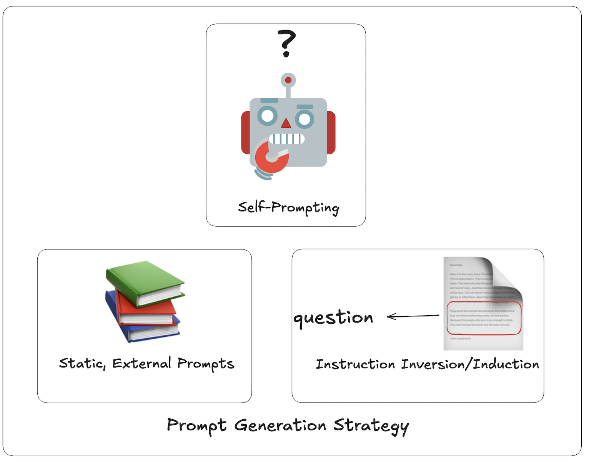
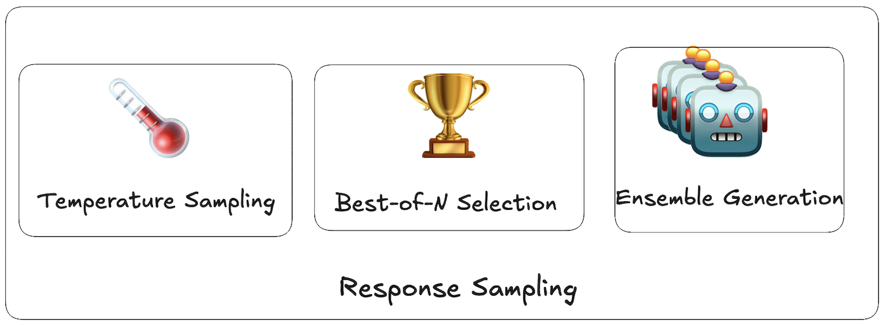
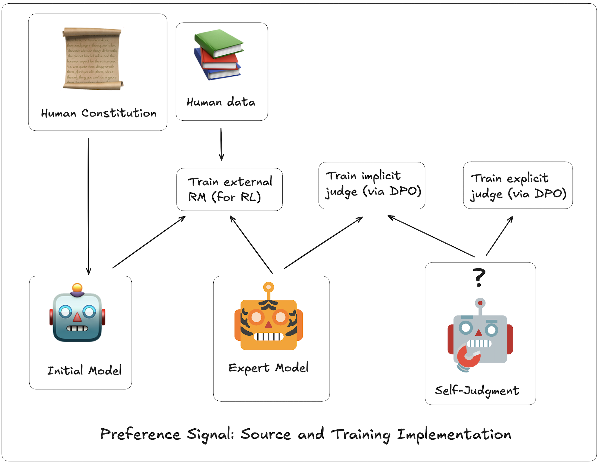
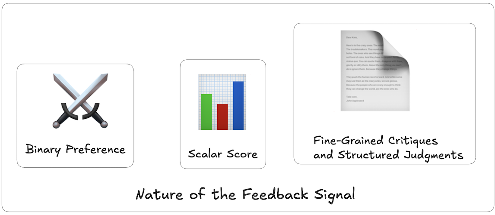
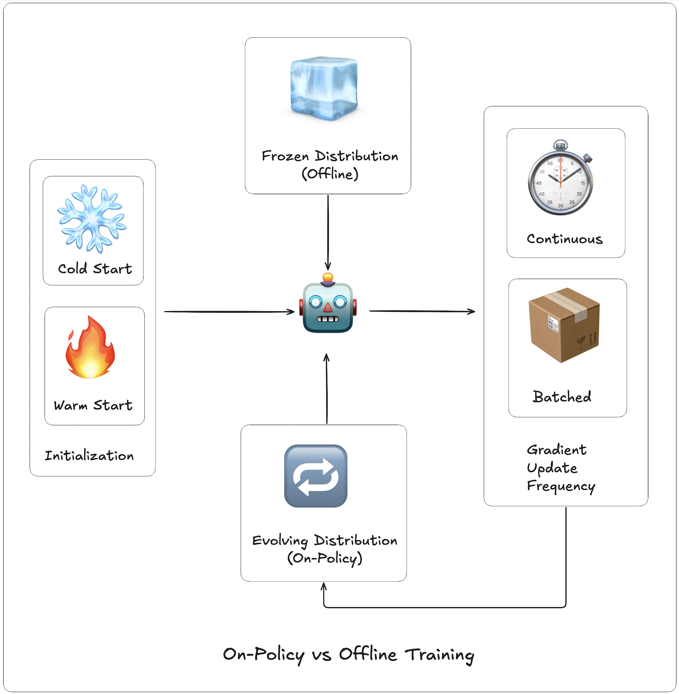

> **Part 2 of 4** in the series "From Human Feedback to Synthetic Alignment"
>
> **[← Part 1: RLHF Limitations](/blog/rlhf-limitations/)** | **[Series Overview](/blog/synthetic-alignment-overview/)** | **[Part 3: Evidence →](/blog/what-works-synthetic-alignment/)**
>
> **[Part 1](/blog/rlhf-limitations/)** established why RLHF faces insurmountable limitations. This article maps the design space of synthetic alignment methods that have emerged in response—revealing which architectural choices matter most and where trade-offs emerge. **[Part 3](/blog/what-works-synthetic-alignment/)** examines the empirical evidence for what actually works. **[Part 4](/blog/synthetic-alignment-future/)** identifies critical open research questions.

---

The emergence of synthetic data alignment represents more than a pragmatic response to RLHF's limitations—it marks the maturation of a new paradigm with its own design principles, trade-offs, and empirical insights. Since the introduction of Constitutional AI (Bai et al., 2022), the field has rapidly evolved, generating a diverse ecosystem of methods that share a common foundation while differing dramatically in their architectural choices.

This article provides a systematic framework for understanding these methods by identifying the critical factors that vary across synthetic alignment pipelines. Rather than treating each paper as an isolated contribution, we map the design space itself, revealing which choices matter most, where trade-offs emerge, and what the empirical evidence tells us about effective alignment strategies.

---

## Part I: The Two Paradigms of Synthetic Alignment

The proliferation of synthetic alignment methods might suggest a chaotic landscape of incomparable approaches. Yet beneath the surface diversity lies a fundamental convergence: the field has crystallized around two distinct paradigms for learning from synthetic preferences, each with its own architecture, trade-offs, and empirical characteristics.

### The RL-Based Paradigm: Explicit Reward Modeling

The first paradigm follows RLHF's traditional architecture but substitutes synthetic feedback for human annotations. This approach maintains the two-stage structure that characterized classical RLHF: first training an explicit reward model on preference data, then using reinforcement learning to optimize the policy against that learned reward function. Methods like Constitutional AI (Bai et al., 2022), RLAIF (Lee et al., 2024), ULTRAFEEDBACK (Cui et al., 2024), and Kim et al.'s (2023) work on aligning LLMs through synthetic feedback all follow this blueprint.

The workflow is familiar to anyone versed in RLHF: generate responses from the policy, collect preference labels (now from AI judges, constitutional principles, or heuristics rather than humans), train a separate reward model on these preferences, and finally optimize the policy using RL algorithms guided by the reward model's scalar outputs. What changes is the source of the preference signal, not the fundamental architecture.

Within this paradigm, the algorithmic choices center primarily on the RL optimization method. Proximal Policy Optimization (PPO) dominates, deployed in Constitutional AI (Bai et al., 2022), ULTRAFEEDBACK (Cui et al., 2024), and Kim et al.'s (2023) synthetic feedback approach. PPO's popularity stems from its use of a clipped objective function that prevents destructively large policy updates—trading computational expense for training stability. Lee et al. (2024) opt for the simpler Advantage Actor-Critic (A2C), a synchronous actor-critic method without PPO's clipping mechanism, which is easier to implement but potentially less stable during training.

The RL-based paradigm's core strength lies in its explicit reward model. This architectural choice enables interpretability—you can inspect what the reward model has learned—and flexible reward shaping, where you can combine multiple reward signals (safety, helpfulness, factuality) with different weightings or modify the reward function without retraining the entire policy. The reward model can be trained on diverse data sources and updated independently from the policy. Perhaps most practically, it can provide scalar scores at any time, enabling techniques like best-of-N sampling during both training and inference.

But these advantages come with costs. The two-stage training process introduces complexity: you must achieve stable reward model training and stable RL optimization simultaneously. The computational burden is substantial, and the entire pipeline can become unstable, particularly in offline settings where the reward model grows stale as the policy evolves. There are simply more moving parts to debug and tune, each introducing potential failure modes.

### The Direct Optimization Paradigm: Collapsing the Two-Stage Architecture

The second paradigm represents a more radical departure from RLHF's architecture: it eliminates the explicit reward model entirely, optimizing the policy directly from preference pairs. This approach, exemplified by Self-Rewarding (Yuan et al., 2025), SAFER-INSTRUCT (Shi et al., 2024), SPaR (Cheng et al., 2025), OAIF (Guo et al., 2024), RLAIF-V (Yu et al., 2025), and SELF-BOOSTING (Dong et al., 2024), collapses the two-stage training process into a single optimization phase.

The workflow is streamlined: generate response pairs from the policy, collect preference labels, and optimize the policy directly using a preference loss function. The mathematical insight underlying this paradigm is that the policy parameters can implicitly encode reward information through the Bradley-Terry model, eliminating the need for a separate reward model component. The policy simultaneously generates responses and, in effect, evaluates them—a dual capability encoded in a single set of parameters.

Direct Preference Optimization (DPO), introduced by Rafailov et al. (2024), has become the standard formulation, adopted by Yuan et al. (2025), Shi et al. (2024), Cheng et al. (2025), Guo et al. (2024), and Yu et al. (2025). DPO's elegance lies in deriving a closed-form solution to the RL objective, avoiding the complexities of actual reinforcement learning. Dong et al. (2024) employ SimPO, a variant that modifies the DPO objective to further improve stability and performance. Guo et al. (2024) experiment with alternative formulations—Identity Policy Optimization (IPO) and Sequence Likelihood Calibration (SLiC)—each with slightly different loss functions and theoretical properties. Yet the practical impact of these variant choices appears modest: Guo et al.'s experiments suggest they perform similarly, with DPO maintaining its position as the most established and well-understood option.

The direct optimization paradigm offers compelling advantages. The pipeline is dramatically simpler: a single optimization stage rather than two. Training becomes more stable, especially in online settings where data is generated from the evolving policy. Guo et al. (2024) demonstrate this conclusively, showing that online DPO maintains significantly better training stability than offline alternatives. The policy parameters encode both generation and evaluation capabilities in a single unified model, eliminating the coordination challenges between separate components.

But simplicity brings its own constraints. The method is fundamentally limited to pairwise preferences; you cannot incorporate arbitrary scalar rewards that might come from external metrics or heuristics. Without an explicit reward model, interpretability suffers, there's no standalone component whose learned preferences you can inspect. The judge capability is inextricably tied to policy evolution, though this can be addressed through explicit judge training, as demonstrated by Wu et al. (2024). The question is whether the architectural simplicity outweighs these limitations.

---

## Part II: Eight Critical Design Factors

While the choice between RL-based and direct optimization paradigms provides the foundational architecture, the devil—and the opportunity—lies in the details. Eight critical design factors cut across both paradigms, and the choices made along these dimensions often matter more than the paradigm choice itself. Understanding these factors provides a lens for analyzing any synthetic alignment method and predicting its likely strengths and weaknesses.

### Factor 1: Prompt Generation Strategy

Where do the prompts come from? This seemingly simple question has profound implications. The diversity and relevance of prompts directly shape what behaviors the model learns to align, defining the effective scope of the alignment process.

The most straightforward approach uses **static, external prompts** drawn from existing datasets. Constitutional AI (Bai et al., 2022) employs red-teaming prompts designed to elicit harmful responses. Cheng et al. (2025) use taxonomy-based prompts to ensure systematic coverage of different instruction types. Cui et al. (2024) curate prompts targeting instruction-following, truthfulness, honesty, and helpfulness. The quality and representativeness of these seed datasets cascades through the entire training process, setting a ceiling on what the aligned model can achieve.

A more sophisticated strategy employs **instruction inversion**—generating prompts by reversing the instruction-following process. Shi et al. (2024) demonstrate this compellingly in the safety domain: they train a reversed instruction model that takes real-world harmful text (hate speech, self-harm content, illegal activities, sexual content) and generates prompts that would have produced it. This inversion process creates more realistic and challenging prompts than purely synthetic generation could achieve, grounding the safety training in actual harmful patterns found in the wild rather than hypothetical scenarios.

The most ambitious approaches use **self-prompting**, where models generate their own training prompts. Dong et al. (2024) employ a self-prompt generator that creates diverse instructions guided by seed topics. Yuan et al. (2025) generate prompts from initial seed data, letting the model expand its own training curriculum. The empirical evidence suggests this diversity is crucial: Dong et al. note that "most of the improvement comes from the prompt diversity" rather than sophisticated response refinement. Self-prompting enables iterative methods to continuously explore new regions of the instruction space, preventing the homogeneity that would come from training on a fixed prompt set.

---

### Factor 2: Response Sampling Strategy

Once you have prompts, how do you generate the candidate responses that will be judged and used for training? This choice affects both the quality distribution of your training data and the computational cost of the alignment process.

The simplest approach is **standard sampling** at a reasonable temperature setting. Kundu et al. (2023) provide an important caveat here: for larger models, temperature doesn't fundamentally affect the diversity-quality tradeoff as conventional wisdom might suggest. Instead, it primarily controls stylistic aspects of the generated text. This finding suggests that sophisticated temperature scheduling may be less important than other factors in the pipeline.

More aggressive is **best-of-N selection**: generate N candidate responses and select the best (or best-worst pair) according to a reward model's scoring. This technique can be deployed during training data collection or at inference time, though the use cases differ subtly. Cui et al. (2024) and Yu et al. (2025) employ best-of-N sampling, with Yu et al. explicitly using normalized scores to mitigate the well-known length bias problem where longer responses spuriously receive higher scores. The obvious trade-off is computational: you multiply inference cost by N, making this approach expensive at scale but potentially valuable when sample quality is paramount.

A third strategy employs **ensemble generation**, creating variation by sampling from multiple models, model sizes, or prompting configurations. Kim et al. (2023) generate responses using various model sizes and few-shot configurations, creating natural diversity in the response distribution. Cui et al. (2024) take this to an extreme, using 17 different models to generate the responses in ULTRAFEEDBACK. Ensemble approaches trade orchestration complexity and computational cost for richer, more diverse training signals.

---

### Factor 3: Actor-Judge-Refiner Configuration

A fundamental architectural question: should you use a single model wearing multiple hats, or should you deploy specialized models for different roles in the pipeline? This choice affects both the elegance of the system and its ultimate capability ceiling.

The **single model, multiple roles** approach has aesthetic and practical appeal. The same model generates responses, judges their quality, and potentially refines them based on critiques. Yuan et al. (2025) and Wu et al. (2024) exemplify this with their actor-judge-meta-judge configurations where one model performs all functions. Constitutional AI (Bai et al., 2022) uses the same model for generation and critique-and-revision. Kim et al. (2023) deploy a single model in RM-guided self-play. This approach is elegant and efficient—you're training one model to be competent across all functions rather than coordinating multiple models. But it demands genuine multi-capability: the model must excel at generation, evaluation, and refinement simultaneously.

The alternative deploys **separate specialized models** for different functions. Cheng et al. (2025) maintain distinct actor M_t and refiner R_t models that evolve separately, M_t focusing on generating better aligned responses and R_t focusing on refining responses and providing judgment. Cui et al. (2024) designed UltraRM, a reward model trained with preference data obtained with GPT-4 as the role of LLM-as-a-Judge. Specialization allows each component to focus on its particular function without compromise, potentially reaching higher capability ceilings. The cost is increased training complexity: you must now coordinate multiple models, manage their separate training processes, and ensure they work together coherently. The question is whether specialization's benefits justify the additional complexity.

---

### Factor 4: Response Refinement and Filtering

Raw model outputs are rarely ideal training signals. How should responses be improved or filtered before they become training data? The spectrum ranges from no modification at all to sophisticated search-based refinement procedures.

The most straightforward approach is **direct comparison with no response modification**. Lee et al. (2024) sample response pairs from an SFT model and have an LLM judge determine which is better. Guo et al. (2024) sample two responses from the current policy and let an LLM annotator select the preferred one. The responses themselves remain untouched—only their relative ranking changes. This preserves the authenticity of the policy's natural output distribution but accepts whatever quality level the policy currently produces.

**Critique-and-revise** methods take the initial response as a starting point for improvement. Constitutional AI (Bai et al., 2022) exemplifies this in its supervised learning stage: the model generates a potentially harmful response, generates a critique referencing constitutional principles, then generates a revised harmless response. Both the critique and revision become training data, creating an explicit trajectory from problematic to aligned behavior. This approach captures not just what good responses look like, but the reasoning process for improving bad ones.

The most computationally intensive approach employs **tree-search refinement** to systematically explore the space of possible improvements. When Cheng et al.'s (2025) refiner judges a response as incorrect, it doesn't settle for a single revision attempt. Instead, it uses tree search to explore multiple refinement paths, selecting the one that best satisfies the instruction. This invests substantial test-time compute during data generation, but the result is demonstrably higher-quality preference pairs that represent the best achievable refinement rather than whatever the first revision attempt produced.

A related technique is **self-play generation**, where models engage in strategic multi-turn interaction to produce high-quality data. Kim et al. (2023) orchestrate RM-guided self-play where two LLMs interact with reward model feedback shaping their strategic choices. The interactive nature allows the models to explore more sophisticated behaviors than single-turn generation would permit.

Beyond refinement lies filtering: which preference pairs should actually be used for training? **Heuristic filtering** applies simple, predefined rules. Kim et al. (2023) assume that larger models with more few-shot examples produce better responses, filtering synthetic preferences based on this assumption. Shi et al. (2024) use GPT-4 to classify generated instructions as safe versus unsafe, keeping only unsafe ones for safety training. Heuristics scale easily and avoid expensive evaluation, but they're brittle: the assumptions may not hold across domains or as models improve, introducing systematic biases into the training data.

More principled is **quality-based filtering** using learned RM either implicit or explicit. Dong et al. (2024) generate both original and refined responses for each prompt, keeping only pairs where the refined version scores higher according to automatic quality metrics. While this sounds similar to critique-and-revise, the distinction is subtle but important: critique-and-revise generates the refined response through an explicit critique step and includes that reasoning in the training data, whereas quality-based filtering simply generates alternative responses and filters them post-hoc based on quality scores without capturing the improvement reasoning. This ensures the preference signal represents genuine improvement rather than random variation. Methods also commonly filter low-confidence preference pairs where the reward model score difference is small, reducing noise in the training data. The approach is more adaptive than heuristics but requires a trustworthy quality estimator—if the quality metric itself is flawed, it propagates errors into training.

---

### Factor 5: Preference Signal Source and Training Implementation

Who or what judges quality, and how is that judgment woven into the training process? This factor is critical yet often conflated: the identity of the judge is separate from how its judgments are operationalized. For example, GPT-4 can serve as a judge, but its labels might either train a separate reward model that guides RL optimization, or feed directly into DPO for policy updates, same judge but completely different training implementations with distinct stability and scaling properties. Understanding both dimensions is essential for predicting a method's behavior.

**Human-authored principles** offer the most interpretable judging mechanism. Constitutional AI (Bai et al., 2022) uses explicit rules to label responses as more or less harmful. These principles guide preference judgments during data generation, but crucially, the principles themselves don't participate in training—only the preferences they produce. Those preferences are used to train an explicit reward model (Bai et al., 2022; Kundu et al., 2023), which then guides policy optimization. The approach is controllable and interpretable but potentially incomplete: the principles might miss important edge cases. Kundu et al. (2023) demonstrate that specific principles outperform general ones, though even general principles provide solid baselines.

**External model judges**, typically GPT-4, have become the dominant approach. Lee et al. (2024), Shi et al. (2024), Cui et al. (2024), and Guo et al. (2024) all use powerful external models to generate preference labels during data collection. But the same labels can be used in different ways: either training an explicit reward model that guides RL (Lee et al., 2024; Cui et al., 2024), or feeding directly into DPO for policy optimization (Shi et al., 2024; Guo et al., 2024). External judges scale well and produce consistent judgments, but they inherit whatever biases the judge model possesses. Guo et al. (2024) demonstrate that judge prompting significantly affects output quality, revealing both controllability and sensitivity.

The most ambitious approach is **self-judgment**: the model being trained generates its own preference labels. Yuan et al. (2025) and Wu et al. (2024) have their models score their own candidate responses. These self-generated labels feed into DPO, where the policy implicitly serves as its own reward model. But a critical design choice emerges in iterative methods: should judging capability be emergent or explicitly trained?

The **emergent** approach (Yuan et al., 2025) uses the current policy checkpoint to judge, leveraging the implicit ability of the policy to be a rewarding model during DPO training (Rafailov et al., 2024). The **explicit training** approach (Wu et al., 2024; Cheng et al., 2025) trains judging capability alongside generation using dedicated training data for the judge role. The empirical verdict is clear: Wu et al. (2024) Meta-Rewarding Models outperforms Self-Rewarding Models Yuan et al. (2025) on comparable benchmarks, with the improvement attributed to explicit judge training rather than relying on emergent judging ability. Self-judgment enables powerful bootstrapping and co-evolution of generation and evaluation, but risks reinforcing biases or premature convergence if not carefully managed. Moreover, Self-Judgment methods can lead to responses with consistent high scores, which yield diminushing returns after 4 iterations.

**Hybrid approaches** blend multiple sources to balance competing objectives. Constitutional AI (Bai et al., 2022) merges AI-generated harmlessness labels with human helpfulness labels, training a multi-objective reward model that navigates between safety and utility. The key insight cutting across all these approaches: judge identity (human principles, external model, self) is independent from training implementation (labels for RM training, labels for DPO, continuous online querying). Most methods use external or self-judgment for labeling, then either train an explicit RM in the RL paradigm or use direct optimization in the DPO paradigm.

---

### Factor 6: Nature of the Feedback Signal

Beyond who judges, what form does the judgment take? The information richness and format of feedback profoundly affects what the model can learn.

At the simplest level, **binary preferences** offer a stark choice: response A is better than response B. This format is not just convenient but required for DPO and similar direct alignment methods. Yuan et al. (2025) generate preference pairs for self-rewarding. Shi et al. (2024) create chosen-rejected pairs for safety training. Binary preferences are maximally simple and align naturally with the Bradley-Terry model underlying DPO, but they discard information about the magnitude of quality differences.

**Scalar scores** provide richer information: a numerical value representing response quality. This is the classic signal for RL-based methods with explicit reward models. Lee et al. (2024) train a reward model to output scalar rewards that guide PPO optimization. Yuan et al. (2025) use LLM-as-a-Judge scores to quantify quality. Scalar rewards enable nuanced distinctions and support techniques like best-of-N selection, but they require a calibrated scoring function that maps to meaningful quality differences.

The richest signals employ **fine-grained critiques and structured judgments** that go beyond simple numbers. These approaches recognize that "quality" is multifaceted and that understanding why responses succeed or fail matters as much as knowing which is better.

Cui et al. (2024) exemplify **multi-dimensional scoring**, using GPT-4 to evaluate responses across multiple aspects—helpfulness, honesty, instruction-following, and more—accompanied by detailed textual critiques. These signals train UltraRM , a reward model that understands different quality facets rather than collapsing everything into a scalar. The multidimensional understanding provides more informative gradients during policy optimization.

Yu et al. (2025) employ **claim-level decomposition** in the vision-language domain, breaking responses into atomic claims, scoring each claim separately for correctness, then aggregating to response-level preferences. This granular signal helps the model learn which specific parts of responses are problematic, identifying which claims in a vision-language response are hallucinations rather than just recognizing that the overall response is flawed.

**Principle-grounded critiques**, as deployed by Bai et al. (2022), explicitly reference which constitutional principles were violated and why. These critiques guide the revision process, creating training data where the model learns not just what to avoid but the reasoning behind the prohibition. The structured reasoning becomes part of the training signal in the supervised learning stage, teaching the model to think through alignment considerations explicitly.

Finally, Cheng et al. (2025) demonstrate **judgment explanations** where the refiner provides not merely a binary correct-incorrect judgment but an explanation of why the response fails to follow the instruction. This structured feedback helps the subsequent tree-search process focus on specific deficiencies that need refinement rather than exploring blindly.

The value proposition is clear: richer signals enable more nuanced learning and teach the reasoning behind judgments, not just which responses are better. But they require more sophisticated judge models and increase the complexity and cost of annotation. The question is whether the marginal improvement from fine-grained feedback justifies the added complexity.

---

### Factor 7: On-Policy vs Offline Training

Perhaps the most critical design choice: should training data be generated from the evolving policy or from a fixed distribution? This decision fundamentally affects distribution alignment and training stability, often mattering more than algorithmic details.

The **offline (static data)** approach generates all preference data once, upfront, from a fixed policy before training begins. The model then trains on this static dataset throughout the alignment process. Constitutional AI's RLAIF stage (Bai et al., 2022), along with Lee et al. (2024), Cui et al. (2024), and Shi et al. (2024), follow this pattern. The computational efficiency is attractive: generate your dataset once and reuse it for many training steps. But as the policy improves during training, it drifts away from the distribution on which the preference data was collected, creating escalating distribution mismatch. The training data becomes stale, increasingly failing to represent the policy's current behavior. The same distribution drift and reward model staleness problem that plagues RLHF's offline training, as discussed in Section 3.2 of our limitations analysis.

**On-policy (dynamic data)** approaches generate training data from the current or recent policy to be used in the next iteration of training, maintaining alignment between the training data distribution and the evolving policy. Yuan et al. (2025), Wu et al. (2024), Cheng et al. (2025), Dong et al. (2024), Guo et al. (2024), and Yu et al. (2025) all adopt this strategy. The benefit is profound: by continuously generating data from the evolving policy, you prevent the distribution shift that plagues offline methods. Guo et al. (2024) demonstrate this conclusively, showing that on-policy training is significantly more stable than offline alternatives—not just marginally better, but fundamentally more reliable.

Within on-policy training, a secondary distinction emerges around update frequency. **Continuous updates** (Guo et al., 2024) update policy parameters after each preference pair or small batch, tightly interleaving data generation and training. This maintains the tightest possible distribution alignment but requires constant judge interaction, making it computationally demanding. **Batched iterations** offer a pragmatic compromise: the policy generates a batch of data, trains on it for multiple steps, then moves to the next iteration in discrete rounds. Yuan et al. (2025) use 3 iterations, Wu et al. (2024) use 4, Cheng et al. (2025) use 3, and Dong et al. (2024) use 4. This approach balances on-policy benefits with computational efficiency and enables convenient checkpointing between rounds.

Most methods employ a **warm start** strategy, combining offline SFT on seed data before proceeding to on-policy alignment. Cheng et al. (2025) initialize both actor and refiner with GPT-4o-Mini data. Most iterative methods start with instruction-tuned models rather than raw base models. Warm starting accelerates convergence by giving the policy a reasonable starting point rather than beginning from scratch. The alternative **cold start** approach, beginning from a base model without task-specific initialization, is rare in practice—the convergence benefits of warm starting are too compelling to ignore.

---

### Factor 8: Evaluation Methodology and Comparability

How we measure success profoundly shapes what we conclude about which design choices matter. Evaluation methodology isn't just about assessing individual papers, it determines which papers can be meaningfully compared and what claims we can make about the relative effectiveness of different approaches.

**The Benchmark Fragmentation Problem**

Different papers use different benchmarks, fragmenting the literature into clusters of comparable and incomparable work. AlpacaEval 2.0 emerges as a common benchmark for iterative self-improvement methods: Yuan et al. (2025), Wu et al. (2024), and Dong et al. (2024) all evaluate on it, enabling direct comparison. All three show substantial improvements—over 20% win rate gains—but the shared benchmark lets us go further, attributing specific improvements to specific design choices. Wu et al. and Dong et al. also share Arena-Hard for complex prompts, showing consistent improvement across iterations. Cheng et al. (2025) center their evaluation on IFEval for instruction-following, where they surpass GPT-4-Turbo performance. Domain-specific evaluations scatter across the literature: TL;DR for summarization (Guo et al., 2024; Lee et al., 2024), safety evaluations for Constitutional AI (Bai et al., 2022), trustworthiness metrics for vision-language models (Yu et al., 2025). Without benchmark overlap, comparing methods becomes speculative at best.

**Human vs Automated Evaluation**

The gold standard remains human evaluation. Lee et al. (2024) conduct head-to-head comparisons. Guo et al. (2024) perform 4-way comparisons showing 58% win rates. Bai et al. (2022) gather crowdworker preferences. Yu et al. (2025) achieve 62.9% win rates against GPT-4V. Kim et al. (2023) use pairwise comparisons. Human evaluation provides the most reliable signal, grounding claims in actual human preferences rather than proxy metrics. But the costs are prohibitive, and the temporal lag makes rapid iteration difficult.

LLM-as-judge evaluation offers a scalable alternative. AlpacaEval 2.0 uses GPT-4 as judge, as do many other benchmarks. This scales far better than human evaluation, enabling rapid experimentation. But biases creep in, especially when the judge model (often GPT-4) was also used in the training pipeline. Shi et al.'s (2024) GPT-4-validated safety results raise questions about circularity: if GPT-4 judges the training data and evaluates the results, how independent is the assessment?

Traditional automated metrics like ROUGE for summarization remain available but increasingly irrelevant. They correlate poorly with human preferences for open-ended generation, measuring surface features rather than actual quality.

**The Regression Testing Imperative**

A critical but often overlooked question: does alignment improve the target capability without degrading others? Dong et al. (2024) provide the most comprehensive regression testing, evaluating across 12 benchmarks (OBQA, Haerae, MathQA, XNLI, Toxigen, PROST, Arc, HellaSwag, TQA, MMLU, Winogrande, GSM8k). Their Llama-8B shows improvements or neutrality across all benchmarks, though Mistral-7B exhibits minor regressions on Winogrande and GSM8k. Wu et al. (2024) and Dong et al. (2024) employ MT-Bench for multi-turn conversational coherence. Cheng et al. (2025) test on GSM8k, TriviaQA, MMLU, and HumanEval, showing no average regression though Mistral-7B experiences some MMLU degradation. Constitutional AI (Bai et al., 2022) and Kundu et al. (2023) verify that harmlessness alignment doesn't reduce helpfulness by training multi-objective reward models. Shi et al. (2024) confirm that safety alignment maintains conversational ability and downstream task performance.

**Tracking Iterative Progress**

Methods with multiple iterations must demonstrate consistent improvement. Yuan et al. (2025) show steady gains across 3 iterations on AlpacaEval 2.0. Wu et al. (2024) train for 4 iterations but observe diminishing returns as judge scores cluster around 5, suggesting response homogeneity limits further improvement. Dong et al. (2024) achieve 22.1%+ win rate improvements over 4 iterations. Cheng et al. (2025) demonstrate gains at each of 3 iterations on IFEval. Zweiger et al. (2025) show ARC task progression but on a limited 8-sample filtered set, making their work more proof-of-concept than scalable system.

**Baseline Selection Matters**

The impressiveness of results depends heavily on baseline choice. Strong baselines—GPT-4, Claude 2, gpt-3.5-turbo—provide meaningful competitive context (Yuan et al., 2025; Cui et al., 2024; Cheng et al., 2025; Yu et al., 2025). Weak baselines like Alpaca or Dolly-v2 (Kim et al., 2023) may understate the remaining gap to state-of-the-art. The most valuable comparisons pit methods against each other directly: Cheng et al. (2025) compare against Yuan et al. (2025) and Wu et al. (2024) using identical data and benchmarks, enabling clean attribution of gains to tree-search refinement specifically. Lee et al. (2024) and Guo et al. (2024) compare directly against RLHF, demonstrating that synthetic feedback can match or exceed human feedback.

Papers using similar initialization strategies (SFT on instruction data) are more directly comparable than those with divergent starting points. Methods avoiding proprietary models or human data (Kim et al., 2023) versus those using GPT-4 labels represent different resource assumptions, complicating cost-effectiveness comparisons.

**A Comparability Map**

Some clusters of work are highly comparable, sharing benchmarks and similar setups. Yuan et al. (2025), Wu et al. (2024), and Dong et al. (2024) all use AlpacaEval 2.0 with iterative approaches and similar model families, enabling precise comparison of their different design choices. Cheng et al. (2025) explicitly compare against Yuan et al. and Wu et al. on IFEval, cleanly attributing their superior performance to tree-search refinement. Lee et al. (2024) conduct direct head-to-head comparisons against RLHF on summarization. Guo et al. (2024) pit online methods against offline DPO and RLAIF on TL;DR with the same judge, isolating the impact of on-policy training.

Other work is moderately comparable—different domains but similar principles. Bai et al. (2022), Kundu et al. (2023), and Shi et al. (2024) all focus on safety though they use different evaluation approaches. Cui et al. (2024) and other general chat alignment methods share enough commonality to draw useful comparisons despite evaluation differences.

Some work has limited comparability: Yu et al.'s (2025) vision-language focus operates in a different modality entirely. Zweiger et al.'s (2025) meta-learning approach with limited evaluation sets represents more proof-of-concept than production system, however propose an interesting feedback signal. Papers evaluated primarily via human evaluation versus automated benchmarks resist direct comparison despite potential similarity in methods.

---

## Navigating the Design Space

We've mapped a complex design space with two fundamental paradigms (RL-based vs. direct optimization) and eight critical factors that shape implementation choices. Each factor introduces trade-offs: on-policy training provides stability at computational cost; explicit judge training improves performance but adds complexity; tree-search refinement yields quality but demands inference compute.

The framework reveals that synthetic alignment isn't a monolithic solution but a toolkit of architectural choices. The "best" configuration depends on your constraints: research budgets favor simpler DPO pipelines; production systems might justify RL-based methods' interpretability; safety-critical applications may demand constitutional principles over emergent judgments.

But understanding the design space is only the first step. Which of these choices actually matter in practice? What does the empirical evidence tell us about effective strategies? **[Part 3](/blog/what-works-synthetic-alignment/)** examines the evidence, providing a scorecard of which RLHF limitations synthetic methods have solved and identifying six empirical insights that shape the field's direction.

---

## References

Bai, Y., Kadavath, S., Kundu, S., et al., 2022. Constitutional AI: Harmlessness from AI Feedback. https://doi.org/10.48550/arXiv.2212.08073

Cheng, J., Liu, X., Wang, C., et al., 2025. SPaR: Self-Play with Tree-Search Refinement to Improve Instruction-Following in Large Language Models. https://doi.org/10.48550/arXiv.2412.11605

Cui, G., Yuan, L., Ding, N., et al., 2024. UltraFeedback: Boosting Language Models with Scaled AI Feedback. https://doi.org/10.48550/arXiv.2310.01377

Dong, Q., Dong, L., Zhang, X., Sui, Z., Wei, F., 2024. Self-Boosting Large Language Models with Synthetic Preference Data. https://doi.org/10.48550/arXiv.2410.06961

Guo, S., Zhang, B., Liu, T., et al., 2024. Direct Language Model Alignment from Online AI Feedback. https://doi.org/10.48550/arXiv.2402.04792

Kim, S., Bae, S., Shin, J., et al., 2023. Aligning Large Language Models through Synthetic Feedback. https://doi.org/10.48550/arXiv.2305.13735

Kundu, S., Bai, Y., Kadavath, S., et al., 2023. Specific versus General Principles for Constitutional AI. https://doi.org/10.48550/arXiv.2310.13798

Lee, H., Phatale, S., Mansoor, H., et al., 2024. RLAIF vs. RLHF: Scaling Reinforcement Learning from Human Feedback with AI Feedback. https://doi.org/10.48550/arXiv.2309.00267

Rafailov, R., Sharma, A., Mitchell, E., et al., 2024. Direct Preference Optimization: Your Language Model is Secretly a Reward Model. https://doi.org/10.48550/arXiv.2305.18290

Shi, T., Chen, K., Zhao, J., 2024. Safer-Instruct: Aligning Language Models with Automated Preference Data. https://doi.org/10.48550/arXiv.2311.08685

Wu, T., Yuan, W., Golovneva, O., et al., 2024. Meta-Rewarding Language Models: Self-Improving Alignment with LLM-as-a-Meta-Judge. https://doi.org/10.48550/arXiv.2407.19594

Yu, T., Zhang, H., Li, Q., et al., 2025. RLAIF-V: Open-Source AI Feedback Leads to Super GPT-4V Trustworthiness. https://doi.org/10.48550/arXiv.2405.17220

Yuan, W., Pang, R.Y., Cho, K., et al., 2025. Self-Rewarding Language Models. https://doi.org/10.48550/arXiv.2401.10020

Zweiger, A., Pari, J., Guo, H., et al., 2025. Self-Adapting Language Models. https://doi.org/10.48550/arXiv.2506.10943
